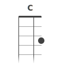

# ukulele-chord
A React component that renders music chord diagrams

## Installation
Run the following command:
    npm install -s ukulele-chord

## Usage

    import UkuleleChord from './lib/UkuleleChord';
    
## Examples

    <UkuleleChord name="C" frets={[3, 0, 0, 0]}/>

    <UkuleleChord name="Db7+" frets={[3, 4, 5, 6]}/>

    <UkuleleChord name="B7" frets={[0, 7, 6, 8]}/>

