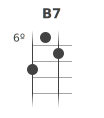

# ukulele-chord
A React component that renders music chord diagrams

## Installation
Run the following command:
    npm install -s ukulele-chord

## Usage

    import UkuleleChord from './lib/UkuleleChord';
    
## Examples
There are only two required arguments: `name` is the name of the chord per ser. And `frets` is the numeric representation of the chord as an `array` of numbers.
```jsx
<UkuleleChord name="C" frets={[0, 0, 0, 3]}/>
```


```jsx
<UkuleleChord name="Db7+" frets={[6, 5, 4, 3]}/>
```


```jsx
<UkuleleChord name="B7" frets={[8, 6, 7, 0]}/>
```




